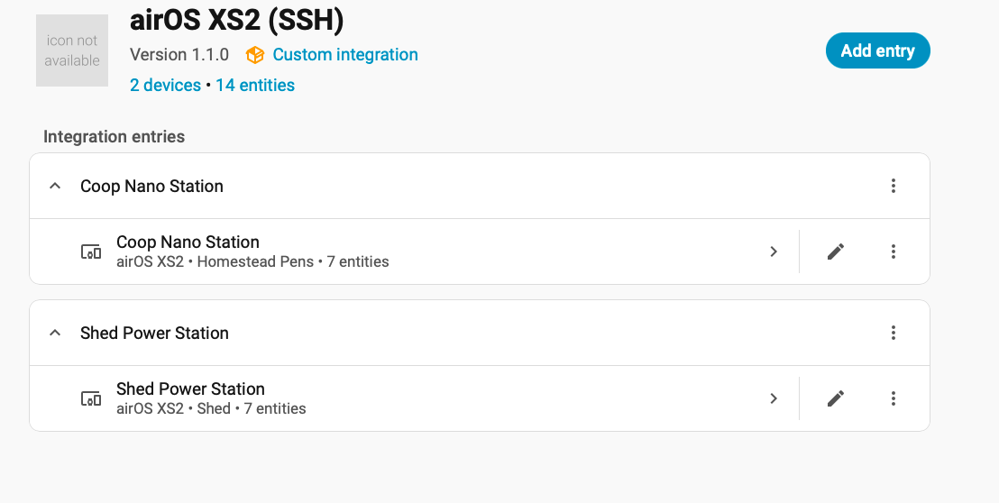
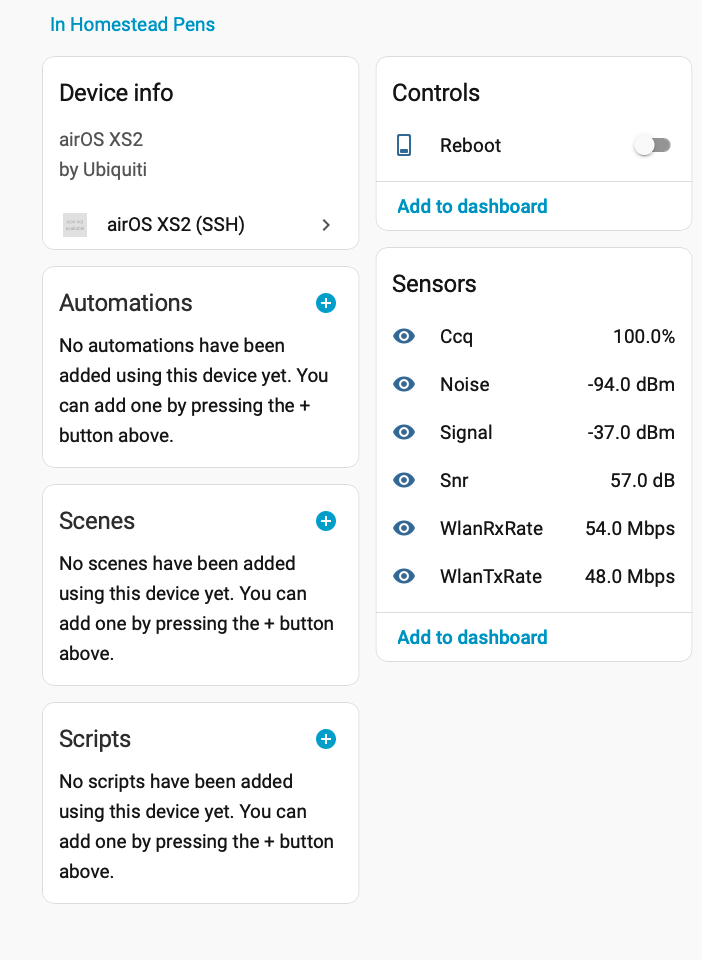
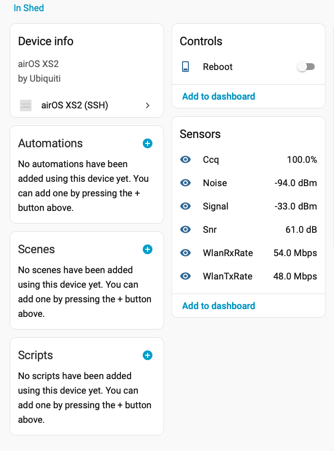

# airOS XS2 (SSH)

Home Assistant custom integration for legacy Ubiquiti airOS XS2 devices (NanoStation2, PowerStation2, etc).

## Features

- SSH polling of `mca-status`
- Signal, Noise, CCQ, SNR
- TX/RX rate monitoring
- Reboot switch
- Config Flow (UI install)
- HACS compatible

---

## Installation (Manual)

1. Download this repository.
2. Copy `custom_components/airos_xs2` into your Home Assistant `/config/custom_components/` directory.
3. Restart Home Assistant.
4. Add integration via **Settings → Devices & Services → Add Integration**.

---

## Installation (HACS)

1. HACS → Integrations → ⋮ → Custom Repositories
2. Add: `https://github.com/cmptrblder/airos_xs2`
3. Category: Integration
4. Install
5. Restart Home Assistant

---

## Screenshots

---

## Compatibility

- airOS XS2 firmware 4.x
- Uses legacy SSH algorithms required by older firmware

---

## License

MIT License
